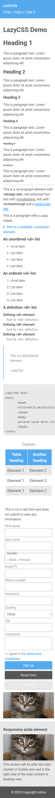
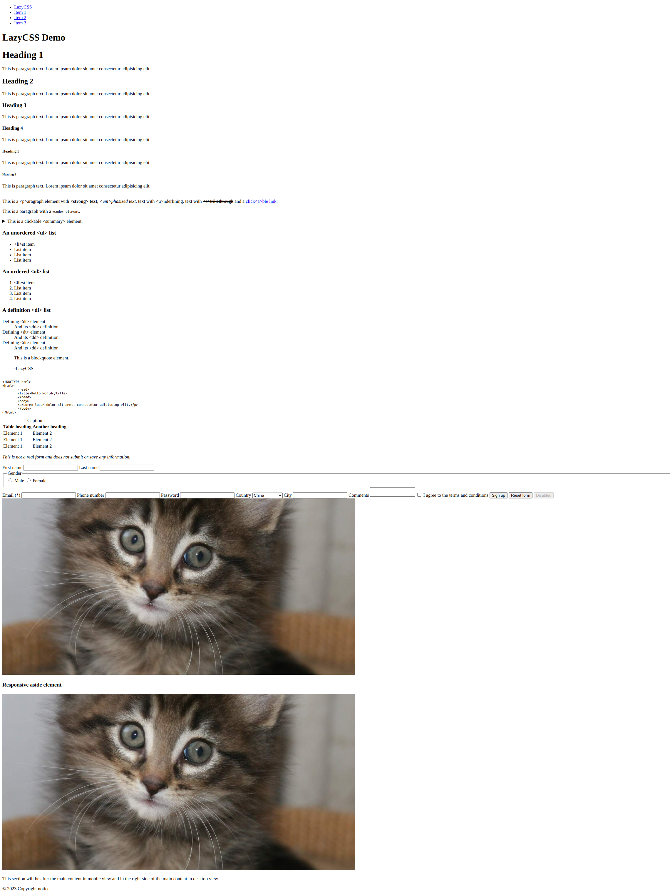
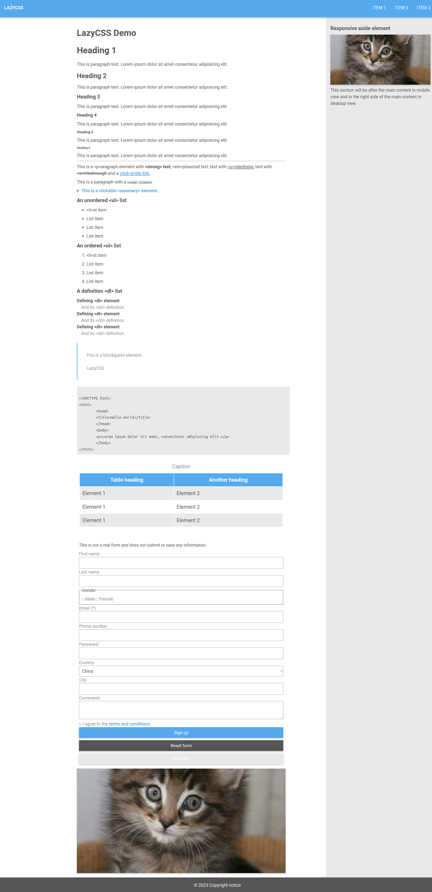

# LazyCSS - classless CSS when you're lazy

Modern websites look the same. Navigation bar at the top, a responsive sidebar and centered content on desktop.
**LazyCSS** is one attempt to create the modern cookiecutter layout effortlessly.

Either use this in your blog or as a general extendable template.

## Installation

Drop this line into your HTML file under `<head>`:
```
<link rel="stylesheet" href="https://raw.githubusercontent.com/hhakk/lazycss/master/lazy.css">
```
And you're done.

Alternatively, download the CSS file from the repo.

This repository contains [a simple demo site](index.html) (screenshots below).

## Features

* Probably smaller than the CSS you're currently using (under 200 lines excluding comments)
* No need to minify
* Configurable with variables (fonts, colors easily changed)
* Responsive sidebar with `<aside>` -element.
* Responsive navbar (with logo placement) by just writing
```
<nav>
  <ul>
    <li>Logo</li>
    <li>Item 2</li>
    <li>Item 3</li>
  </ul>
</nav>
```

## License

See [LICENCE](LICENCE).

## Screenshots
### Mobile

Before:


After:



### Desktop

Before:



After:


